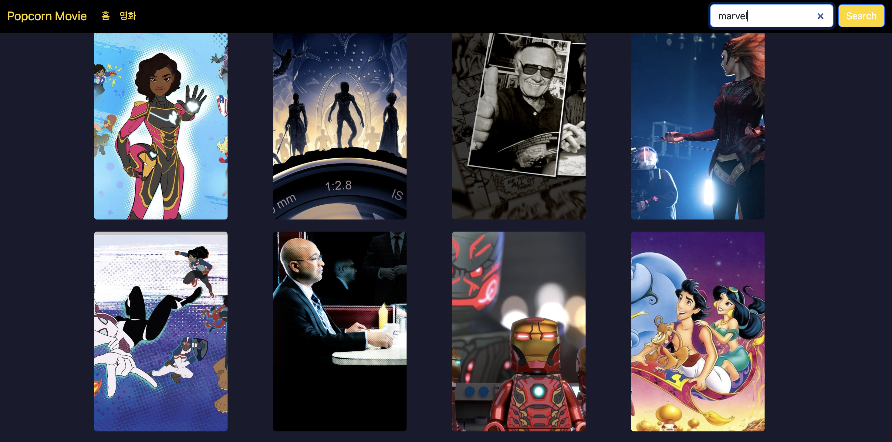

# 영화 관리 시스템

## 📜 서비스 내용

**영화 관리 시스템**은 사용자가 최신 영화 목록을 조회하고, 각 영화의 상세 정보를 확인할 수 있는 웹 애플리케이션입니다. 사용자는 영화의 제목, 개봉일, 장르, 예고편, 평점 등을 실시간으로 확인할 수 있으며, 또한 영화 검색과 페이지네이션 기능을 통해 더욱 쉽게 영화를 탐색할 수 있습니다.

### 주요 기능

1. **현재 상영 중인 영화 목록 조회**: 서버에서 현재 상영 중인 영화 목록을 동적으로 가져와 화면에 렌더링합니다.
2. **영화 상세 정보 보기**: 사용자가 선택한 영화의 상세 정보를 확인할 수 있습니다. 영화의 장르, 개봉일, 평점, 예고편 등을 제공합니다.
3. **영화 검색**: 사용자가 검색창을 통해 영화를 검색할 수 있습니다.
4. **페이지네이션 기능**: 영화 목록이 많을 경우, 페이지네이션 라이브러리를 이용하여 여러 페이지로 나누어 영화를 탐색할 수 있습니다.
5. **영화 예고편 및 리뷰**: 사용자는 영화 예고편을 보고, 리뷰를 확인할 수 있습니다.
6. **로딩 상태 및 에러 처리**: 서버와의 통신 중 로딩 상태를 표시하고, 에러가 발생하면 사용자에게 오류 메시지를 제공합니다.

## 🛠 기술 스택

- **React Router**
- **React Query**
- **Axios**
- **React Bootstrap**
- **React Slider**
- **React Paginate**

## 🖥 개발 내용

### 1. 영화 관리 시스템 구현

#### 1.1 현재 상영 중인 영화 목록

서버에서 실시간으로 현재 상영 중인 영화 목록을 동적으로 가져와 화면에 렌더링합니다. `React Query`를 사용하여 필요한 데이터를 가져오고, `Axios`로 HTTP 요청을 처리했습니다. `React Query`는 데이터를 캐시하여 성능을 최적화하고, 서버에서 데이터를 다시 불러오는 과정을 개선했습니다.

#### 1.2 영화 상세 정보 페이지

영화의 제목, 개봉일, 장르, 평점 등의 정보를 확인할 수 있는 상세 페이지를 구현했습니다. 또한, 영화의 예고편을 자동 재생할 수 있도록 하여, 사용자가 영화에 대해 더 깊이 알 수 있도록 했습니다. React Query를 통해 영화의 세부 정보를 비동기적으로 가져왔고, `React Bootstrap`을 사용하여 상세 정보를 표현했습니다.

#### 1.3 영화 검색 기능

사용자가 영화 제목을 검색할 수 있도록 검색창을 구현했습니다. `React Router`를 사용하여 검색 결과 페이지로 이동하며, 검색된 영화 목록을 동적으로 표시합니다. 검색 기능은 사용자가 입력한 키워드를 기반으로 `Axios`를 통해 서버에서 해당하는 영화 목록을 받아옵니다.

#### 1.4 페이지네이션 기능

`React Paginate` 라이브러리를 활용하여 영화 목록을 페이지 단위로 나누어 표시합니다. 페이지네이션은 서버에서 가져온 영화 목록의 총 개수를 기반으로 자동으로 페이지 수를 계산하고, 사용자가 쉽게 여러 페이지를 탐색할 수 있도록 합니다. 페이지네이션을 통해 한 페이지에 많은 영화 정보가 표시되지 않도록 하여 UX를 개선했습니다.

### 2. 서버 통신 및 데이터 처리

`Axios`를 사용하여 서버와의 HTTP 요청을 처리했습니다. 서버에서 영화 목록과 상세 정보를 가져오는 데 사용되며, `React Query`와 결합하여 비동기 데이터 처리 및 캐싱 기능을 구현했습니다. `React Query`는 데이터를 캐시하여 성능을 최적화하며, 리팩토링을 통해 성능을 개선할 수 있었습니다.

### 3. 로딩 상태 및 에러 처리

서버 통신 중 로딩 상태를 표시하고, 에러 발생 시 사용자에게 오류 메시지를 표시하여 사용자 경험을 향상시켰습니다. `React Bootstrap`의 `Spinner`를 사용하여 로딩 상태를 시각적으로 처리하고, 에러 시 `Alert`를 통해 에러 메시지를 제공합니다.

## 💡 성장 경험

### **기술적 문제 해결**

React, Axios, React Query 등 새로운 기술을 배우면서 발생한 문제들을 해결해 나갔습니다. 특히, 서버와의 통신 및 데이터 처리에서 발생할 수 있는 성능 이슈를 `React Query`와 `Axios`를 활용하여 해결했습니다. 영화 목록을 실시간으로 가져오고, 데이터를 효율적으로 캐싱하는 방법을 배웠습니다.

### **페이지네이션과 검색 기능 구현**

영화 목록이 많을 경우 페이지네이션을 사용하여 여러 페이지로 나누어 영화 정보를 탐색할 수 있도록 했습니다. 또한, 검색 기능을 추가하여 사용자가 원하는 영화를 쉽게 찾을 수 있도록 했습니다. 이 과정을 통해 **상호작용성 높은 UI/UX 설계**와 **효율적인 데이터 페칭**에 대한 이해를 높일 수 있었습니다.

## 👀 서비스 화면

